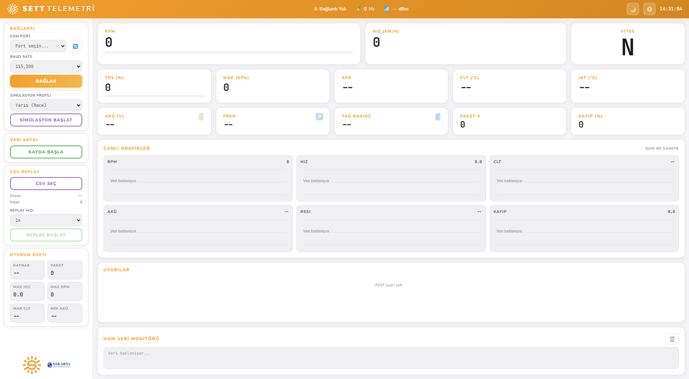
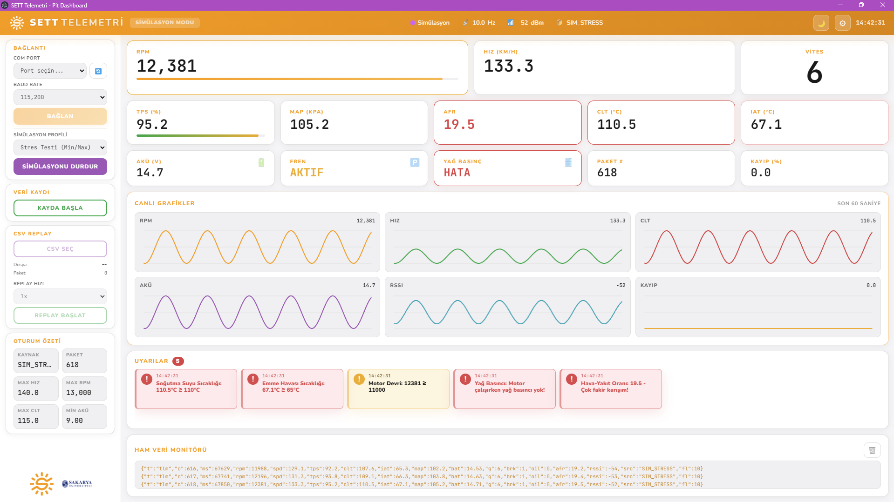
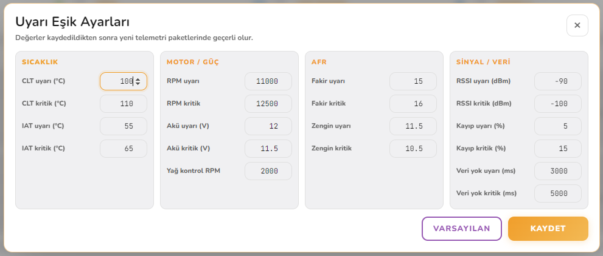

# SETT Telemetri

SETT-SAU Formula Student takımının pit tarafında kullandığı Electron tabanlı telemetri arayüzü.

Araç üzerindeki ESP32 telemetri kartı CAN/sensör verilerini E220 LoRa modülü ile pit tarafına gönderir. Pit tarafındaki ESP32 alıcı kart bu veriyi USB seri port üzerinden uygulamaya aktarır. Uygulama canlı değerleri gösterir, uyarıları takip eder ve oturumları CSV olarak kaydeder.

## Ekran Görüntüleri

### Ana ekran



### Simülasyon modu



### Uyarı eşik ayarları



## Bağlantılı Repo

Telemetri kartı donanım dosyaları ayrı repoda tutuluyor:

[SETT Telemetri Kartı](https://github.com/kaanfurkankaya/SETT-Telemetri-Karti)

## Sistem Akışı

```text
Araç ESP32 + E220
        |
        | LoRa
        v
Pit ESP32 + E220
        |
        | USB Serial
        v
Pit bilgisayarı / SETT Telemetri uygulaması
```

- Araç tarafı CAN Bus ve sensör verilerini okur.
- Veriler compact JSON formatına çevrilir ve LoRa üzerinden gönderilir.
- Pit tarafı paketi alır, USB seri porttan uygulamaya aktarır.
- Uygulama veriyi işler, dashboard'u günceller, uyarı üretir ve istenirse CSV log tutar.

## Kurulum

### Gereksinimler

- Node.js v18 veya üzeri
- npm
- Windows 10/11

### Çalıştırma

```bash
cd "SETT Telemetri"
npm install
npm start
```

Geliştirme modunda başlatmak için:

```bash
npm run dev
```

## Kullanım

### Simülasyon modu

1. Uygulamayı başlatın.
2. Sol panelden `Simülasyon Başlat` butonuna basın.
3. Dashboard pist koşullarını taklit eden canlı verilerle güncellenir.
4. Üst barda `SIM_RACE` kaynağı ve örnekleme hızı görünür.

Simülasyon TPS, RPM, hız, AFR, CLT, IAT, MAP ve akü değerlerini birbirine bağlı şekilde üretir. Belirli aralıklarla düşük akü, yüksek sıcaklık ve benzeri uyarı senaryoları da denenir. Varsayılan hız 10 Hz'dir.

### Canlı grafikler

Dashboard'daki `Canlı Grafikler` bölümü son 60 saniyelik telemetri geçmişini çizgi grafik olarak gösterir.

- RPM, hız, CLT, akü, RSSI ve paket kaybı aynı ekranda izlenir.
- Grafikler gerçek seri port, simülasyon ve CSV replay verisinde aynı şekilde çalışır.
- Test sırasında ani kopma, hararet yükselişi veya batarya düşüşü tek anlık sayı yerine zaman içindeki eğilimiyle görülebilir.

### Gerçek ESP32 ile kullanım

1. Pit alıcı ESP32 kartını USB ile bilgisayara bağlayın.
2. Uygulamayı açın.
3. Sol panelden COM portu seçin.
4. Baud rate değerini seçin. Varsayılan değer `115200`.
5. `Bağlan` butonuna basın.
6. Veri geldikçe dashboard ve ham veri monitörü güncellenir.

### CSV veri kaydı

1. Bağlantı veya simülasyon aktifken `Kayda Başla` butonuna basın.
2. Kayıtlar `logs/` klasörüne CSV olarak yazılır.
3. `Kaydı Durdur` ile oturumu bitirin.
4. CSV dosyaları Excel, Python/pandas veya MATLAB ile analiz edilebilir.

### CSV replay modu

Kaydedilmiş bir CSV oturumu uygulama içinde tekrar oynatılabilir.

1. Sol panelde `CSV Replay` bölümünden `CSV Seç` butonuna basın.
2. `logs/` klasöründeki bir telemetri CSV dosyasını seçin.
3. Replay hızını `0.5x`, `1x`, `2x` veya `5x` olarak ayarlayın.
4. `Replay Başlat` ile kaydedilmiş veriyi dashboard, uyarılar, ham veri monitörü ve canlı grafiklerde tekrar oynatın.

Bu altyapı ileride yarış videosu üzerine telemetri bindirme için de kullanılabilir. Video kaydı ile aynı CSV oturumu eşleştirilirse RPM, hız, vites, CLT ve benzeri değerler video üzerinde gösterilebilir.

## Sıralı Telemetri Testi

Paket kaybını, counter takibini ve CSV log bütünlüğünü kontrol etmek için sıralı test firmware'i kullanılabilir.

1. Araç tarafındaki ESP32'ye `firmware/esp32_vehicle_tx_sequence_test` kodunu yükleyin.
2. Pit tarafındaki ESP32'ye `firmware/esp32_pit_rx` kodunu yükleyin.
3. E220 modüllerini USB-TTL ile aynı ayarlara getirin.
4. Normal çalışma için `M0=0`, `M1=0` yapın.
5. Uygulamadan COM portu seçip `Bağlan` butonuna basın.

Beklenen davranış:

- Üst barda `SEQ` kaynağı görünür.
- RPM 1000-9500 aralığında, hız 0-120 km/h aralığında, vites N-1-2-3-4-5-6 döngüsünde ilerler.
- CLT, akü ve yağ basıncı uyarıları doğru eşiklerde tetiklenir.
- Counter ardışık artar. CSV'de counter kopması yoksa LoRa hattı sağlıklı çalışıyor demektir.

Varsayılan hız 10 Hz'dir. Firmware içinde `STRESS_TEST_MODE true` yapılırsa test 20 Hz'e çıkar.

## E220 LoRa Ayarları

### USB-TTL ile konfigürasyon

E220 ayarları USB-TTL adaptörü ile dışarıdan yapılır. ESP32 firmware içinde modül konfigürasyonu yazan bir bölüm yoktur.

| USB-TTL | E220 modül |
| --- | --- |
| TX | RXD |
| RX | TXD |
| GND | GND |
| 5V | VCC |

Config modunda `M0=1`, `M1=1` olmalıdır. Ayar bittikten sonra normal çalışma için `M0=0`, `M1=0` yapılır.

### Modül ayarları

| Parametre | Değer | Not |
| --- | --- | --- |
| Baud Rate | 115200 | UART haberleşme hızı |
| Parity | 8N1 | Standart |
| Air Rate | 62.5 kbps | LoRa kablosuz hız |
| Packet Size | 200 bytes | Paket bu sınırın altında kalmalı |
| Transmission Mode | Transparent | Şeffaf iletim |
| Power | 30 dBm | Maksimum güç |
| Channel | 23 | İki modül aynı kanal olmalı |
| Address | 0 | Broadcast |
| Key | 0 | Şifresiz |
| LBT | Off | Gecikmeyi azaltmak için kapalı |
| Channel RSSI | Off | Kapalı |
| Packet RSSI | Off | Açılırsa son byte'a RSSI eklenir ve JSON parser bozulur |

### ESP32 - E220 pin bağlantıları

| ESP32 pin | E220 modül | Not |
| --- | --- | --- |
| GPIO 17 (TX) | RXD | Çapraz bağlantı |
| GPIO 16 (RX) | TXD | Çapraz bağlantı |
| GPIO 4 | M0 | Normal modda LOW |
| GPIO 5 | M1 | Normal modda LOW |
| GPIO 34 | AUX | Modül hazır/meşgul bilgisi |
| 5V | VCC | Stabil 5V besleme |
| GND | GND | Ortak toprak |

VCC için 5V kullanılmalı. 3.3V özellikle 30 dBm çıkış gücünde yeterli olmayabilir.

### AUX pin kullanımı

- AUX, GPIO34'e bağlanmalıdır.
- `AUX HIGH` modülün hazır olduğunu gösterir.
- `AUX LOW` modülün meşgul olduğunu gösterir.
- Firmware veri göndermeden önce AUX durumunu kontrol eder.
- AUX uzun süre LOW kalırsa paket atlanır ve `lora_drop_count` artar.

## Veri Formatı

Parser iki formatı destekler: compact JSON ve legacy JSON.

### Compact JSON

Compact format paket boyutunu düşük tutar ve 200 byte sınırının altında kalacak şekilde tasarlanmıştır.

```json
{"t":"tlm","c":1521,"ms":834220,"rpm":6500,"spd":72.4,"tps":38.2,"clt":86.5,"iat":34.1,"map":78.3,"bat":13.7,"g":3,"brk":0,"oil":1,"afr":13.2,"src":"SEQ","fl":0}
```

### Legacy JSON

Eski uzun alan adları da geriye uyumluluk için okunur.

```json
{"type":"telemetry","counter":1521,"time_ms":834220,"rpm":6500,"speed":72.4,"tps":38.2,"clt":86.5,"iat":34.1,"map":78.3,"battery":13.7,"gear":3,"brake":0,"oil_ok":true,"afr":13.2,"flags":["OK"]}
```

### Alan eşleşmeleri

| Compact | Legacy | Tip | Açıklama |
| --- | --- | --- | --- |
| `t` | `type` | string | `tlm` veya `telemetry` |
| `c` | `counter` | int | Paket sayacı |
| `ms` | `time_ms` | int | Araç tarafı zaman bilgisi |
| `rpm` | `rpm` | int | Motor devri |
| `spd` | `speed` | float | Hız |
| `tps` | `tps` | float | Gaz kelebeği |
| `clt` | `clt` | float | Soğutma suyu sıcaklığı |
| `iat` | `iat` | float | Emme havası sıcaklığı |
| `map` | `map` | float | Manifold basıncı |
| `bat` | `battery` | float | Akü voltajı |
| `g` | `gear` | int/string | Vites |
| `brk` | `brake` | int | Fren durumu |
| `oil` | `oil_ok` | int/bool | Yağ basıncı durumu |
| `afr` | `afr` | float | Hava-yakıt oranı |
| `src` | `data_source` | string | Veri kaynağı |
| `fl` | `flags` | int/array | Hata/uyarı bayrakları |

### Flags bitmask

| Bit | Değer | Anlam |
| --- | --- | --- |
| 0 | 0x00 | OK |
| 1 | 0x02 | HIGH_CLT |
| 2 | 0x04 | LOW_BATTERY |
| 3 | 0x08 | OIL_FAULT |
| 4 | 0x10 | WEAK_RSSI |
| 5 | 0x20 | SENSOR_INVALID |
| 6 | 0x40 | CAN_TIMEOUT |
| 7 | 0x80 | RESERVED |

`fl=0` sorun yok anlamına gelir. `fl=6`, HIGH_CLT ve LOW_BATTERY bayraklarının birlikte geldiğini gösterir.

## CSV Log Formatı

```csv
timestamp,time_ms,counter,rpm,speed,tps,clt,iat,map,battery,gear,brake,oil_ok,afr,rssi,ecu_status,data_source,flags,flags_bitmask,warnings
1716825022000,834220,1521,6500,72.4,38.2,86.5,34.1,78.3,13.7,3,0,true,13.2,-84,,SEQ,OK,0,
```

## Uyarı Eşikleri

| Koşul | Seviye |
| --- | --- |
| CLT >= 110°C | KRİTİK |
| CLT >= 100°C | UYARI |
| Akü <= 11.5V | KRİTİK |
| Akü <= 12.0V | UYARI |
| RPM >= 12500 | KRİTİK |
| Yağ basıncı yok ve RPM > 2000 | KRİTİK |
| RSSI <= -100 dBm | KRİTİK |
| 5 saniye veri yok | KRİTİK |
| AFR >= 16.0 | KRİTİK |
| AFR <= 10.5 | KRİTİK |

Uyarılar hem `warningService` eşikleriyle hem de firmware'den gelen `fl` bitmask değeriyle çalışır.

## Proje Yapısı

```text
SETT Telemetri/
├── Ayarlar.png
├── YeniFoto.png
├── YeniSim.png
├── main.js
├── preload.js
├── index.html
├── index.css
├── renderer.js
├── package.json
├── src/
│   ├── config/defaults.js
│   ├── models/telemetry.js
│   └── services/
│       ├── loggingService.js
│       ├── parserService.js
│       ├── replayService.js
│       ├── serialService.js
│       ├── simulationService.js
│       └── warningService.js
├── firmware/
│   ├── esp32_vehicle_tx/
│   ├── esp32_vehicle_tx_sequence_test/
│   ├── esp32_pit_rx/
│   └── esp32_USBTTL_bridge_code/
└── logs/
```

## Bilinen Eksikler

- Gerçek CAN Bus entegrasyonunun araç üstünde tamamlanması
- Uygulama içinden eşik ayarı düzenleme
- Windows kurulum paketi
- Otomatik yeniden bağlanma
- E220 Packet RSSI için özel parser
- Binary packet parser desteği
- Video overlay/export modu (CSV replay verisini yarış videosu üstüne bindirme)

## Lisans

SETT-SAU Formula Student Takımı - İç kullanım
